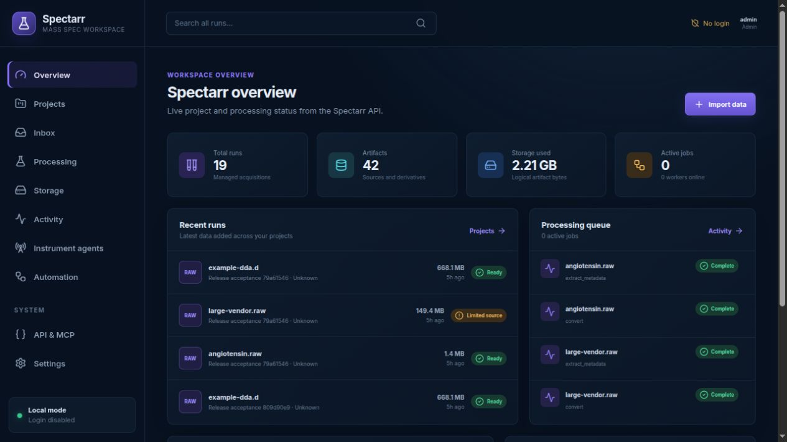
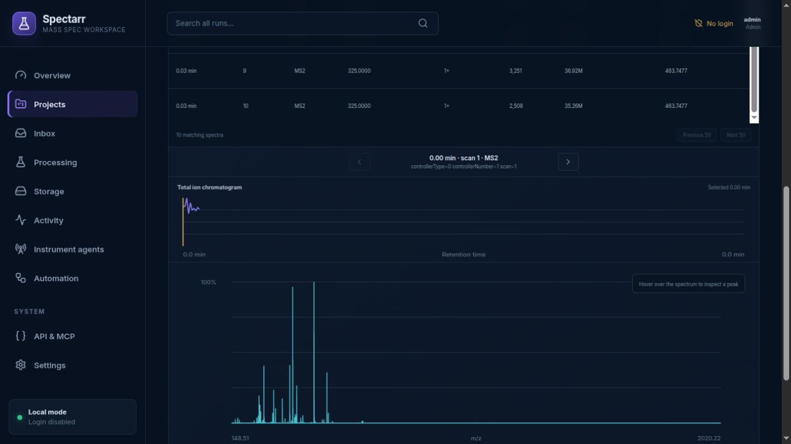

# Spectarr

### A self-hosted home for mass spectrometry data

Spectarr turns scattered instrument files into an organized, searchable workspace. Keep every original acquisition, inspect spectra in the browser, generate reproducible open formats, and automate intake from instrument computers.

[](https://github.com/pgarrett-scripps/spectarr/actions/workflows/ci.yml)
[](LICENSE)




## Stop digging through instrument folders

Mass spectrometry data tends to end up spread across acquisition PCs, network shares, processing folders, and personal naming systems. Spectarr gives a lab one place to answer the questions that should be easy:

- Where is the original file for this run?
- Which project and sample does it belong to?
- Has it been converted to mzML or MGF?
- What did the instrument actually record?
- Can I trust the file and reproduce how a derivative was made?

Spectarr stores source acquisitions as immutable, checksummed artifacts. It also creates a normal human-readable library, so existing search engines and analysis tools can keep working with ordinary files and folders.

## What you can do

### Organize projects and runs

Browse from projects to experiments to individual runs. Search across the whole workspace, move inbox acquisitions into the right experiment, and keep source files, samples, processing history, and annotations together.

Import several acquisitions at once with a shared project and experiment. Review filename-based run names, edit samples, follow each upload, and retry failed items without repeating completed imports. See [batch import](docs/batch-import.md).

### Inspect spectra without leaving the browser

Filter large spectrum catalogs by scan, retention time, MS level, precursor, charge, peak count, and intensity. Select a row to view the spectrum and chromatogram without loading an entire run into the browser.



### Convert files reproducibly

Generate mzML, mzXML, MGF, and MS2 with pinned ProteoWizard profiles. Every derivative records its source checksum, processing profile, tool version, parameters, and output checksum.

### Collect data automatically

Run the acquisition agent beside a Windows or Linux instrument computer. It waits for acquisitions to finish, treats vendor directories as a single unit, resumes interrupted uploads, and keeps an offline queue when the server is unavailable.

### Automate the routine work

Create rules that extract metadata or generate desired formats when a source arrives. Processing batches support previews, progress, cancellation, retry, and regeneration of reclaimed derivatives.

### Connect other tools safely

Use the REST API, signed webhooks, or the read-only MCP server to build search, reporting, and assistant workflows without giving those tools direct access to Spectarr's database.

## One container, no database server

Spectarr runs as one container with SQLite and filesystem storage. The dashboard, API, spectrum reader, metadata extractor, converter, webhook worker, and MCP server are packaged together.

Your durable data lives in one directory:

```text
data/
├── .spectarr/
│   └── runtime-secrets.json
├── spectarr.db
└── storage/
    ├── objects/
    └── library/
```

Schedule verified backups to a separate directory under **Settings → Backups**, or use the included online backup tool. See [managed backup setup](docs/backup-integration.md). Restore tests boot the backup as a separate Spectarr instance and verify both the database and artifact storage.

See the [reliability and recovery guide](docs/reliability-and-recovery.md) for upload recovery, backup verification, restore isolation, and dependency maintenance.

## Quick start

Spectarr targets Linux x86-64 and requires Docker. Start the published image with one command:

```console
docker run -d --name spectarr --restart unless-stopped -p 127.0.0.1:3280:8000 --mount source=spectarr-data,target=/data --mount type=bind,source=/var/run/docker.sock,target=/var/run/docker.sock ghcr.io/pgarrett-scripps/spectarr:latest
```

Open [http://localhost:3280](http://localhost:3280) and create the first administrator account.

Spectarr creates and persists its internal secrets automatically. The named volume keeps the database, files, and secrets across container replacement.

For Compose, download the standalone file and start it. No environment file is required:

```bash
curl -LO https://github.com/pgarrett-scripps/spectarr/releases/latest/download/compose.yaml
docker compose up -d
```

The optional GitHub release bundle contains backup and restore tools, smoke fixtures, and the acquisition agent. See the [release installation guide](release/README.md) for bind mounts, reverse proxies, rootless Docker, and instrument-agent guidance.

## Supported data

Spectarr understands open formats directly and uses vendor readers or ProteoWizard where appropriate.

| Data | Import | Metadata and spectra | Conversion |
| --- | --- | --- | --- |
| mzML and gzipped mzML | Yes | Native streaming reader | Yes |
| mzXML | Yes | Native streaming reader | Yes |
| MGF | Yes | Native streaming reader | Yes |
| MS2 | Yes | Native streaming reader | Yes |
| Thermo RAW | Yes | Direct reader or mzML derivative | Yes |
| Bruker `.d` | Atomic directory import | Direct reader or mzML derivative | Yes |
| Other ProteoWizard vendor formats | Yes | mzML derivative | Yes |

Real-file acceptance currently covers Thermo RAW, a large vendor RAW fallback, an atomic Bruker `.d` acquisition, all four output formats, cancellation and retry, authenticated downloads, reclamation, and deterministic regeneration. See the [acceptance report](docs/acceptance-testing.md) for recorded checksums and spectrum counts.

## A readable library for existing tools

Spectarr keeps content-addressed source objects for integrity and a separate human-readable view for people and analysis software:

```text
library/
└── plasma-proteomics__7fc2a010/
    ├── raw/
    │   └── patient-01__sample-a__31d62c18.raw
    ├── mzml/
    │   └── patient-01__sample-a__31d62c18.mzML
    ├── mgf/
    └── .spectarr/
        └── runs/
            └── 31d62c18-....json
```

On one filesystem, the readable files are hard links and do not consume duplicate space. Project and run manifests preserve stable identifiers and provenance for tools that scan the library directly.

## Designed for real lab workflows

- Immutable source acquisitions with SHA-256 verification
- Resumable and idempotent instrument uploads
- Atomic handling of native vendor directories
- Project, experiment, sample, and multiplexed-run metadata
- Automatic QC summaries, TIC and BPC previews, and spectrum catalogs
- Revisioned conversion profiles and desired-output automation
- Project SDRF generation, validation, TSV round trips, and repository export
- Derived-file reclamation without losing provenance or regeneration history
- Password authentication, scoped API keys, worker credentials, and signed webhooks
- Online SQLite backup with independent restore verification

## Project status

Spectarr is preparing its first public release. The release candidate passes the complete single-container rehearsal, including concurrent ingestion, forced restart recovery, conversion, spectrum reads, MCP initialization, signed webhook delivery, browser interaction, backup, and independent restore boot.

The most useful feedback now is from core facilities and research groups willing to try Spectarr with real acquisition patterns and vendor files. Please use [GitHub Issues](https://github.com/pgarrett-scripps/spectarr/issues) for bugs, workflow gaps, and format compatibility reports. Security concerns should follow [SECURITY.md](SECURITY.md).

<details>
<summary><strong>Architecture and development notes</strong></summary>

### Runtime shape

```text
Instrument folders -> Acquisition agent -> Resumable upload API
                                             |
Dashboard + REST + MCP -> Spectarr API -> SQLite + artifact storage
                                             |
                         +-------------------+------------------+
                         |                                      |
                  Metadata extractor                    MSConvert worker
                         |                                      |
                  QC and spectra                         mzML, mzXML,
                  catalogs                              MGF, and MS2
```

The single container supervises the API, dashboard, converter, extractor, webhook worker, spectrum reader, and MCP server. ProteoWizard conversion uses the configured Docker-compatible socket. A rootless Docker daemon is recommended for deployed systems.

### Source development

Source builds use the sibling `msconvert-cli`, `mzmlpy`, and `spxtacular` repositories pinned in `DEPENDENCIES.env`. With those checkouts beside Spectarr:

```bash
make up
```

Run the complete component suite with:

```bash
make test
```

Run the container release gate with:

```bash
SPECTARR_RUN_E2E=true scripts/ci-integration.sh
```

The current suite covers the API, migrations, dashboard, converter, metadata extractor, acquisition agent, webhook worker, MCP contracts, concurrent SQLite recovery, and the browser release workflow.

### Service endpoints

- Dashboard: `http://localhost:3280`
- REST API: `http://localhost:3280/api/v1`
- OpenAPI: `http://localhost:3280/docs`
- MCP: `http://localhost:8281/mcp`

</details>

## License

Spectarr is available under the [Apache License 2.0](LICENSE).
