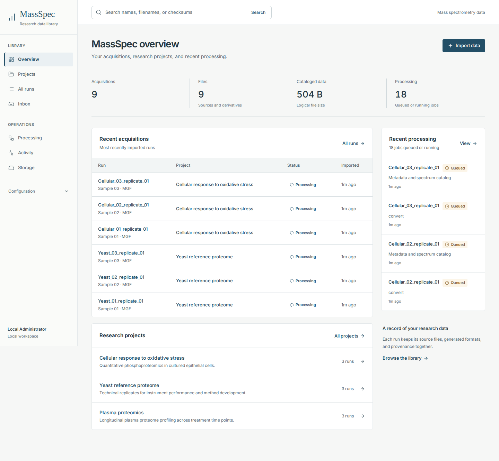
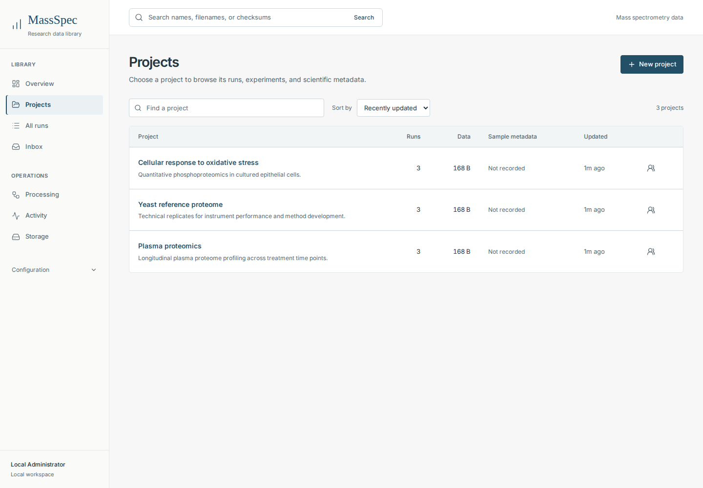

# Research interface review

September 24, 2026

The interface is organized around three questions: which research data do I have, where does it belong, and what can I do with it next? Project, acquisition, and file identity take priority over server administration and decorative dashboard metrics.

## Design decisions

- Use a light, neutral surface, readable text, thin borders, and one restrained blue accent. Reserve semantic colors for status. Remove gradients, glowing indicators, decorative metric cards, and the fixed file-format donut.
- Group navigation into Library, Operations, and collapsible Configuration. Keep search visible throughout the workspace. Search accepts names, original filenames, and checksums.
- Present projects as a searchable, sortable table. Show description, run count, data size, SDRF status, and update time together. Keep the instrument inbox in its dedicated workflow.
- Focus the overview on recent acquisitions, research projects, and processing. Use the complete queue depth, rather than counting jobs in the recent sample.
- Label cataloged bytes as logical file size. Remove the disk-utilization bar and unsupported healthy indicator. Volume capacity remains separately labeled in Storage.
- Retain the run sections for summary, spectra, files, processing, and provenance. Make source paths and checksums readable and keep file location details expandable.
- Apply the shared theme to imports, SDRF editing, processing, storage, administration, and dialogs. Preserve existing workflow capabilities.
- Add a skip link, visible focus styling, keyboard-accessible table scrolling, mobile navigation focus management, and reduced-motion styling. Resize spectrum coordinates to the actual plotting area so labels remain readable and peak inspection stays aligned.

## Verification

`make frontend-test` passed: 117 unit tests, TypeScript checks, ESLint, and the production build.

`frontend/e2e/research-ui.spec.ts` passed all seven Chromium checks. These cover project search and table containment at 320, 390, 768, 1024, and 1440 pixels, keyboard table scrolling, mobile navigation focus, returning to desktop, and dialog focus restoration. API responses in these regression tests are isolated fixtures.

A separate temporary application instance verified populated overview, projects, runs, file location and clipboard, imports, generated SDRF editing, processing, storage, activity, agents, automation, integrations, settings, and mobile layouts. No browser page errors or horizontal page overflow occurred in the tested screens. Spectrum rendering used synthetic API responses because that temporary instance had no spectrum reader configured. This checks presentation, not vendor conversion or scientific extraction accuracy.

The existing library and production configuration were not used for these checks. This pass changes frontend source and builds the dashboard. It does not deploy or restart an existing installation.

The Docker image was subsequently built and smoke-tested with an isolated database. All 104 packaged converter, extractor, MCP, and webhook tests passed. Three production dependency pins were aligned with the current sibling spectrum library requirements: paftacular 1.2.0, peptacular 3.3.0, and tdfpy 4.0.1. The browser theme color now matches the light interface.

A separate SQLite snapshot successfully migrated from revision 0010 to 0013 with its project, run, and artifact counts preserved and its integrity check passing. The running installation was not upgraded. Applying the prepared image to an older installation also updates the backend and database, so that is a separate deployment decision.

## Previews

These screenshots contain synthetic review data.

[Mobile spectrum viewer](assets/research-ui-mobile-spectra.png)
